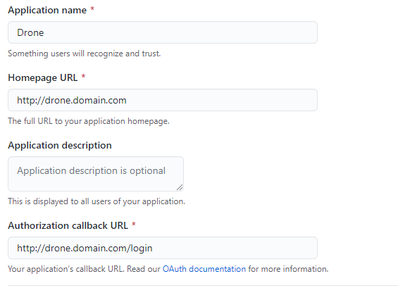
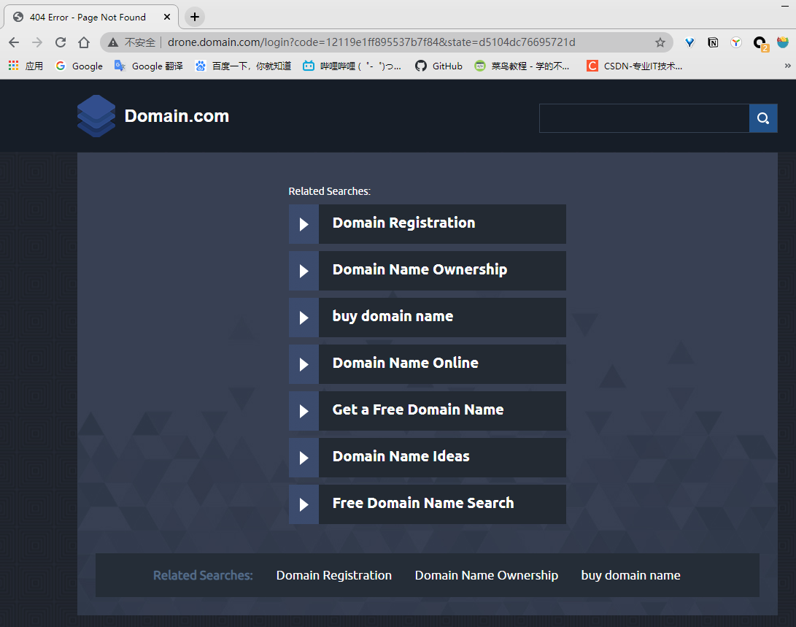
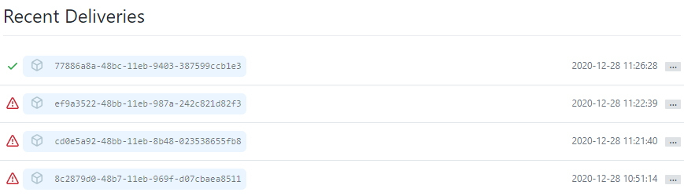

# 流水线工具调研

## Drone

https://www.drone.io/

### 1. 准备工作

创建一个OAuth应用程序: Settings - OAuth Apps - New OAuth App

Homepage URL 和 Authorization callback URL 填你自己的Drone服务器的地址，这是一个Webhook，当代码提交等事件触发时就会向该服务器发送事先定义好的请求。前者为服务器主页，后者为认证的地址，若第一次访问主页则会跳转到认证的URL。

创建一个共享密钥，以验证 runner 与中央 Drone 服务器之间的通信。

您可以使用openssl生成共享机密：

~~~bash
openssl rand -hex 16
abd2ea5baed1800ee8ac64003956ed77
e70a6a4be8a10decdeef8959c1d9e4f04a0a55e3
~~~

### 2. 下载

下载 drone 的 docker 镜像

~~~
# 中央服务
docker pull drone/drone:1
# Runner，
docker pull drone/drone-runner-docker:1
~~~

### 3. 配置

drone 的服务使用环境变量来配置

~~~
DRONE_GITHUB_CLIENT_ID=3e0c94638b876903d131
DRONE_GITHUB_CLIENT_SECRET=e70a6a4be8a10decdeef8959c1d9e4f04a0a55e3
DRONE_RPC_SECRET=abd2ea5baed1800ee8ac64003956ed77
DRONE_SERVER_HOST=117.78.10.6:80
DRONE_SERVER_PROTO=http
~~~

### 4. 运行

Server

~~~bash
docker run \
  --volume=/var/lib/drone:/data \
  --env=DRONE_GITHUB_CLIENT_ID=3e0c94638b876903d131 \
  --env=DRONE_GITHUB_CLIENT_SECRET=e70a6a4be8a10decdeef8959c1d9e4f04a0a55e3 \
  --env=DRONE_RPC_SECRET=abd2ea5baed1800ee8ac64003956ed77 \
  --env=DRONE_SERVER_HOST=117.78.10.6:80 \
  --env=DRONE_SERVER_PROTO=http \
  --publish=9000:80 \
  --publish=443:443 \
  --restart=always \
  --detach=true \
  --name=drone \
  drone/drone:1
~~~

Runner

~~~
docker pull drone/drone-runner-docker:1
~~~

~~~
docker run -d \
  -v /var/run/docker.sock:/var/run/docker.sock \
  -e DRONE_RPC_PROTO=http \
  -e DRONE_RPC_HOST=117.78.10.6:9000 \
  -e DRONE_RPC_SECRET=abd2ea5baed1800ee8ac64003956ed77 \
  -e DRONE_RUNNER_CAPACITY=2 \
  -e DRONE_RUNNER_NAME=${HOSTNAME} \
  -p 9001:3000 \
  --restart always \
  --name runner \
  drone/drone-runner-docker:1
~~~

~~~
docker logs runner
time="2020-12-25T02:22:42Z" level=info msg="starting the server" addr=":3000"
time="2020-12-25T02:22:42Z" level=info msg="successfully pinged the remote server"
time="2020-12-25T02:22:42Z" level=info msg="polling the remote server" arch=amd64 capacity=2 endpoint="http://192.168.0.73:9000" kind=pipeline os=linux type=docker

docker logs drone
{"level":"info","msg":"main: internal scheduler enabled","time":"2020-12-25T02:16:46Z"}
{"interval":"30m0s","level":"info","msg":"starting the cron scheduler","time":"2020-12-25T02:16:46Z"}
{"interval":"24h0m0s","level":"info","msg":"starting the zombie build reaper","time":"2020-12-25T02:16:46Z"}
{"acme":false,"host":"192.168.0.73:80","level":"info","msg":"starting the http server","port":":80","proto":"http","time":"2020-12-25T02:16:46Z","url":"http://192.168.0.73:80"}
~~~

### 配置流水线

## Drone原理

### 运行流程

1. webhook触发drone server
2. 找到repo下的 .drone.yml ，将定义的流水线解析成docker steps，调用docker服务，获取镜像，启动容器，执行命令，将log展示在web ui上， 

## 问题

### 1.主页404

若按照官网教程安装完毕之后在浏览器进入，显示该页面，是因为Github上App的url没改，填的是Drone官方的url。

可以在 Settings->Webhooks 检查 Webhook是否正确，url应该是 http(s)://your url/hook，并且可以看到请求的发送记录。

### 2.流水线Docker连不上Git

流水线触发，go get连不上github，但是在服务器上能连上。

